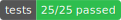
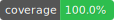

# testreport

[](https://jsr.io/@continuit/testreport)
[](https://www.npmjs.com/package/@continuit/testreport)
[](https://github.com/ContinuIT-nl/testreport/actions/workflows/ci.yml)
[](./test_results/test_results.md)
[](./test_results/test_results.md)
[](https://opensource.org/licenses/MIT)

This utility creates a test report from a JUnit XML file and a LCOV file or checks if a test report is up to date with the current test results.

It has two modes of operation:

- Create a test report and badges from a JUnit XML file and a LCOV file.
- Check if a previous test report is up to date with the current test results.

This utility can be used to create the test report inside your repository.
The report can be referenced from the README.md file and the generated badges can be used to show the test results on the repository page.

The second mode can be used to check if a previous test report is up to date with the current test results.
This can be used to ensure that the test report is updated with the current test results, for example when running tests on a CI server.

## Usage

| Platform | Command                              |
| -------- | ------------------------------------ |
| npm      | `npm install @continuit/testreport`  |
| deno     | `deno add jsr:@continuit/testreport` |

For other platforms see [jsr.io](https://jsr.io/packages/@continuit/testreport) for more information.

## Basic usage

Create a test report definition file, for example `testreport.json`:

```json
{
  "$schema": "https://raw.githubusercontent.com/ContinuIT-nl/testreport/refs/heads/main/configSchema/testReportConfigSchema.json",
  "input": {
    "junit": ["test_results/junit.xml"],
    "coverage": ["test_results/cov.lcov"]
  },
  "limits": {
    "test_percentage_failed": 0,
    "test_percentage_disabled": 0,
    "coverage_percentage_minimal": 80
  },
  "manifest": {
    "output": "test_results/test_results.json"
  },
  "markdown": {
    "output": "test_results/test_results.md"
  },
  "testBadge": {
    "output": "test_results/test_badge.svg",
    "label": "tests",
    "style": "flat",
    "color_ok": "#2EBE4E",
    "color_none": "#888800",
    "color_disabled": "#888800",
    "color_failed": "#990000"
  },
  "coverageBadge": {
    "output": "test_results/coverage_badge.svg",
    "label": "coverage",
    "style": "flat",
    "levels": [
      { "threshold": 99, "color": "#2EBE4E" },
      { "threshold": 90, "color": "#888800" },
      { "threshold": 0, "color": "#990000" }
    ]
  }
}
```

### `input`

| Key        | Type     | Description                                        |
| ---------- | -------- | -------------------------------------------------- |
| `junit`    | string[] | The JUnit XML files to include in the test report. |
| `coverage` | string[] | The LCOV files to include in the test report.      |

### `limits`

| Key                           | Type   | Description                                       | Default Value |
| ----------------------------- | ------ | ------------------------------------------------- | ------------- |
| `test_percentage_failed`      | number | The percentage of failed tests that is allowed.   | 0             |
| `test_percentage_disabled`    | number | The percentage of disabled tests that is allowed. | 0             |
| `coverage_percentage_minimal` | number | The minimum coverage percentage that is required. | 0             |

### `manifest`

| Key      | Type   | Description                              |
| -------- | ------ | ---------------------------------------- |
| `output` | string | The path to the manifest file to create. |

### `markdown`

| Key               | Type    | Description                              | Default Value |
| ----------------- | ------- | ---------------------------------------- | ------------- |
| `output`          | string  | The path to the markdown file to create. |               |
| `badges`          | boolean | Whether to create badges.                | true          |
| `collapseDetails` | boolean | Whether to collapse the details.         | false         |

### `testBadge`

| Key              | Type   | Description                                              | Default Value |
| ---------------- | ------ | -------------------------------------------------------- | ------------- |
| `output`         | string | The path to the test badge file to create.               |               |
| `label`          | string | The label of the test badge.                             | "tests"       |
| `style`          | string | The style of the test badge.                             | "flat"        |
| `color_label`    | string | The color of the test badge label.                       | "#555"        |
| `color_ok`       | string | The color of the test badge when the tests pass.         | "#2EBE4E"     |
| `color_none`     | string | The color of the test badge when no tests are run.       | "#888800"     |
| `color_disabled` | string | The color of the test badge when the tests are disabled. | "#888800"     |
| `color_failed`   | string | The color of the test badge when the tests fail.         | "#990000"     |

### `coverageBadge`

| Key           | Type   | Description                                    | Default Value |
| ------------- | ------ | ---------------------------------------------- | ------------- |
| `output`      | string | The path to the coverage badge file to create. |               |
| `label`       | string | The label of the coverage badge.               | "coverage"    |
| `style`       | string | The style of the coverage badge.               | "flat"        |
| `color_label` | string | The color of the coverage badge label.         | "#555"        |
| `levels`      | array  | The levels of the coverage badge.              |               |

### `levels`

| Key         | Type   | Description                          | Default Value |
| ----------- | ------ | ------------------------------------ | ------------- |
| `threshold` | number | The threshold of the coverage badge. | 80            |
| `color`     | string | The color of the coverage badge.     | "#2EBE4E"     |

All output files are optional. If you want to perform the `--check` command, you need to provide at least the `manifest` file.

Run the testreport utility:

```bash
deno run -RW jsr:@continuit/testreport testreport.json
```

or if you use npm:

```bash
testreport testreport.json
```

In the above example the test report will be created in the `testresults` folder.
Normally you would reference the test report from the README.md file and the badges from the repository page.
The folder `testdata` with the JUnit XML file and the LCOV file should not be checked into the repository.
In your CI pipeline you can run the testreport utility and check if the test report is up to date with the current test results.

```bash
testreport --check testreport.json
```

This will check if the test report is up to date with the current test results.
If the test report is not up to date, the utility will exit with a non-zero exit code.

## Setup

As long as JUnit XML and LCOV files are generated, the test report can be created.

### Deno

Run your tests to generate the JUnit XML file and the `coverage` folder. Then convert the `coverage` folder to a LCOV file.

```bash
deno test --coverage --clean --junit-path test_results/junit.xml
deno coverage --lcov --output=test_results/cov.lcov
```

### Jest

Make sure Jest and Jest-junit are installed:

```bash
npm install --save-dev jest jest-junit
```

Run your tests to with code coverage enabled.

```bash
jest --coverage
```

And in your `jest.config.js` configuration file add the following:

```typescript
module.exports = {
  ...,
  reporters: [
    'default',
    ['jest-junit', {outputDirectory: 'outputFolder', outputName: 'junit.xml'}],
  ]
}
```

### Vitest

Make sure Vitest and a coverage library is installed:

```bash
npm install --save-dev vitest @vitest/coverage-v8
```

An example of a minimal `vitest.config.ts`:

```typescript
import { defineConfig } from 'vitest/config';

export default defineConfig({
  test: {
    coverage: {
      enabled: true,
      provider: 'v8',
      reporter: ['lcov'],
    },
    environment: 'node',
    globals: true,
    include: [...],
    exclude: [...],
    reporters: ['junit'],
    outputFile: 'test-results.xml',
  },
});
```

## Code quality

The code quality is measured using unit tests and code coverage. See the [Test report](./test_results/test_results.md) for more information.

## License

This project is licensed under the MIT license. See the [LICENSE](./LICENSE) file for details.
